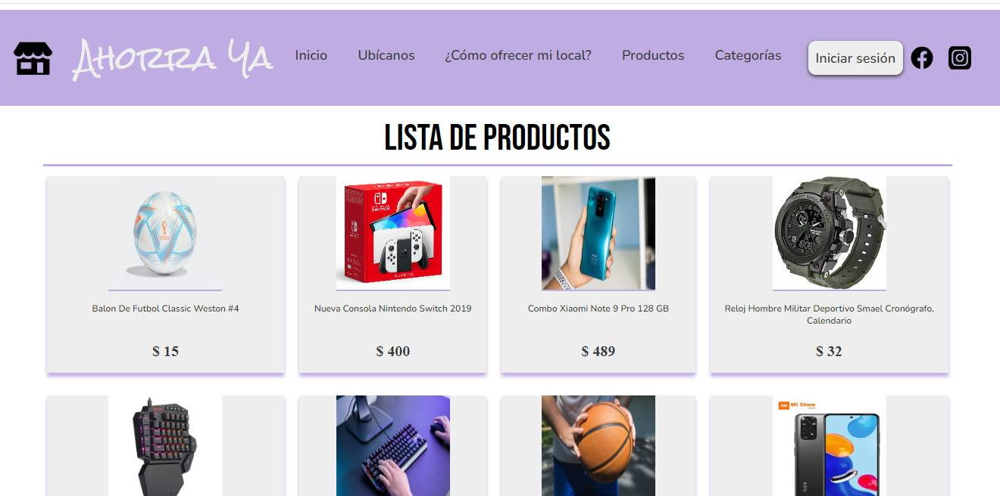

# WEB "AHORRA YA" :dollar: :credit_card:

Code for make to build Shopping Website, consume REST API **Neunapp**


Learn to design responsive use mixins of SASS.

## STACK TECH :hammer:

* Vue 3
* Vue CLI
* Vue Router
* Sass
* Css Grid
* Flexbox
* REST API Neunapp
* Axios

## Screenshot 



## Project setup
```
npm install
```


### Compiles and hot-reloads for development
```
npm run serve
```

### Compiles and minifies for production
```
npm run build
```

### Lints and fixes files
```
npm run lint
```

### Customize configuration
See [Configuration Reference](https://cli.vuejs.org/config/).
